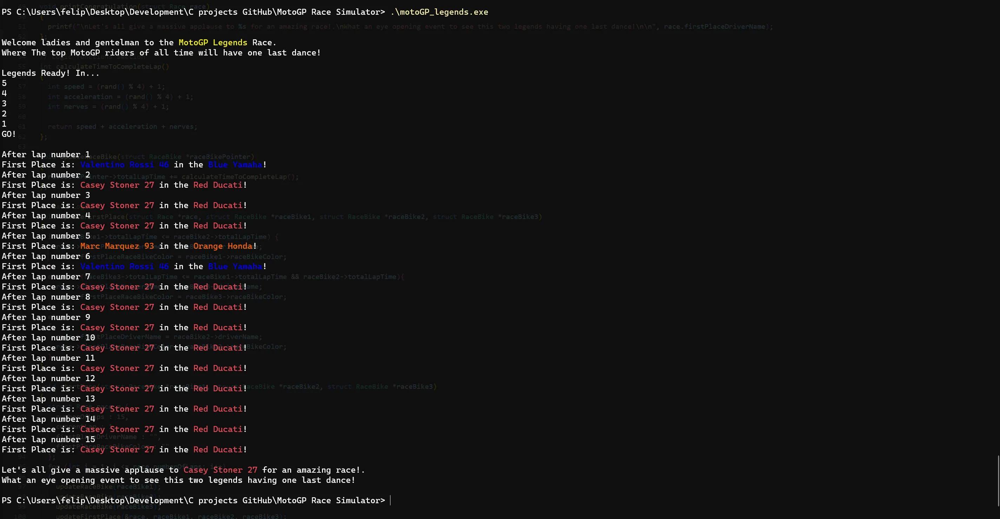

## 📄 Description

🏁 This is a project in which I built a MotoGP race simulator game using the C programming language.
The game brings together the top MotoGP riders of all time for one last race, using structures and pointers to set the race logic. 🏁

The simulation features three legendary riders: 

🔴 Casey Stoner (Ducati) | 🔵 Valentino Rossi (Yamaha) | 🟠 Marc Márquez (Honda)

The race consists of 15 laps, and each rider’s performance is determined by three key factors:

* Acceleration
* Nerves
* Speed

These parameters are randomly generated for each lap, influencing the total lap time.
The program continuously checks which rider is in the lead using if statements and updates the standings accordingly.
A for loop ensures the race progresses until all laps are completed.

*The output is displayed using ANSI colors, when run in a compatible terminal.

* No AI code 🚫🤖 

## 📒 How to run 

Assuming gcc is installed, in your terminal type the following commands:

    gcc main.c -o motoGP_legends
    ./motoGP_legends.exe

    
## 📷 Screenshots

  

